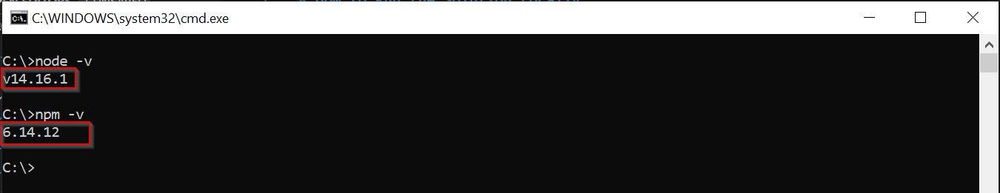

## Install Node.js and npm
Install [node.js](https://nodejs.org/en/) and [npm](https://docs.npmjs.com/downloading-and-installing-node-js-and-npm). If you use the [node.js installer](https://nodejs.org/en/download/), npm is already included so you don't need to install it. 

To see if you already have Node.js and npm installed and to check the installed version, run in a console the commands `node -v` and `npm -v` and you will get a message (version number may change depending on the installed version) like the following: 

||
|:--:|
|*node.js and npm installed versions*|

> You can open a console by pressing `Win + R` keys, write `cmd` in the `Open` input and press `Ok`