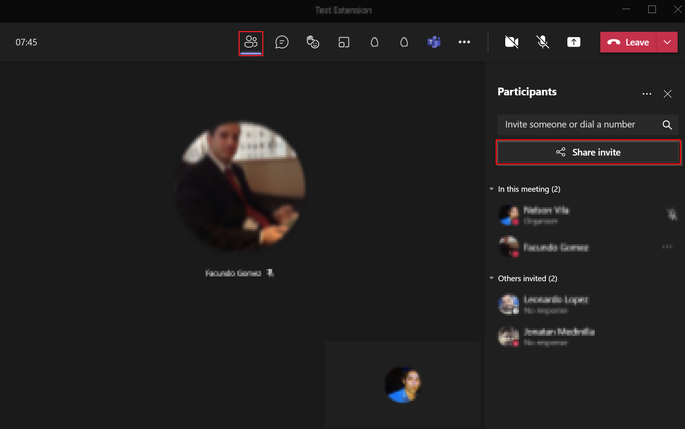

# [WIP] How to run the solution in Azure

>**This is a draft and its format and content may change in future updates.**

> todo
> change app registration of management api link x2 times in app registration
> change app service link to docs in cors section

## Getting Started
The objective of this document is to explain the necessary steps to configure and run the Web Portal solution in Azure. This includes:

  - [Create a new App Registration](#create-a-new-app-registration)
  - [Create a new Azure Storage Account](#create-a-new-azure-storage-account)
  - [Build the solution](#build-the-solution)
  - [Configuring the Solution](#configuring-the-solution)
  - [Upload the build to the storage container](#upload-the-build-to-the-storage-container)
  - [Test the Solution](#test-the-solution)

### Create a new App Registration

Create a new [App Registration](https://docs.microsoft.com/en-us/azure/active-directory/develop/quickstart-register-app) in Azure for the solution.

* `Name`: Any meaningful name (e.g: `broadcaster-app-spa`). 

* `Authentication`: 

  * `Platform configurations`: Single-page application (the Redirect URLs will be configured later). 

  * `Implicit grant and hybrid flows`: Select both “Access tokens” and “ID tokens”. 

  * `Supported account types`: Accounts in this organizational directory only. 

* `Certificates and clients`: None. 

* `Token configuration`: Press on `Add groups claim` and `Save` a new one with following configuration. Keep `Emit groups as role claims` unchecked for all types. 

  * `Id`: Group ID. 

  * `Access`: Group ID. 

  * `SAML`: Group ID. 

* `API permissions`: Add the following permissions to this application. Note that the first permission is the API scope that was created for the [Management API](https://github.com/microsoft/Teams-Broadcast-Extension/blob/documentation/docs/how-to-run-the-solution-in-azure/app_registrations.md#how-to-setup-management-api-application-registration) application. 


API / Permission name | Type | Admin consent
---------|----------|---------
 access_as_producer | Delegated | No
 User.Read  | Delegated | No


* `Expose an API`: None. 

* `App roles`: None. 

After creating this App Registration copy the app ID and modify the Manifest of the App Registration created to the [Management API](https://github.com/microsoft/Teams-Broadcast-Extension/blob/documentation/docs/how-to-run-the-solution-in-azure/app_registrations.md#how-to-setup-management-api-application-registration) adding the following property: 

 
```json
"knownClientApplications": ["{{application-id}}"] 
```

### Create a new Azure Storage Account

[Create](https://docs.microsoft.com/en-us/azure/storage/common/storage-account-create?tabs=azure-portal) an Storage Account that will be used to host the single-page solution. 

- `Name`: broadcaster-portal (or any other meaningful name). 
- `Region`: same region as the rest of the resources. 
- `Performance`: Standard. 
- `Redundancy`: Locally-redundant storage (LRS). 

Leave the rest of the settings as-is. Once this Storage Account is created, go to the `Static website` option on menu in the `Data management` section of the storage account. In it, change the following settings and press `Save` button: 

- `Static website`: Enabled. 
- `Index document name`: index.html 
- `Error document path`: index.html 

||
|:--:|
|*Static Website Configuration*|

>Copy the value of `Primary endpoint` that will appear after pressing save, we will use it later to configure the solution.

### Build the solution

Go to the root directory of the solution, open a command prompt and enter the following command: `npm run build`.

>You can open a console in a particular directory by holding down the ***shift*** key and right clicking on an empty space and selecting the option `Open PowerShell window here`.
>


||
|:--:|
|*Console after enter the `npm run build` command*|

After a few seconds the build of the solution will be finished and a new `build` directory will be created in the root directory of the solution. The console will display a message like the following:

||
|:--:|
|*Console after finishing the build*|

### Configuring the solution

In the Azure Portal, go to the App registration created above. Click on the menu option `Authentication` of the `Manage` section and Add a new [Redirect URI](https://docs.microsoft.com/en-us/azure/active-directory/develop/quickstart-register-app#add-a-redirect-uri) with the value of the `Primary endpoint` in the `Static website` menu of the Storage Account (e.g: `https://broadcaster-portal.z22.web.core.windows.net/`)

Open the `config.json` file located in the `build` folder of the solution's root directory (created in the [previous step](#build-the-solution)) and edit the following parameters:

```json
{
  "buildNumber": "0.0.0",
  "apiBaseUrl": "{{apiBaseUrl}}/api",
  "releaseDummyVariable": "empty",
  "msalConfig": {
    "spaClientId": "{{spaClientId}}",
    "apiClientId": "{{apiClientId}}",
    "groupId": "{{groupId}}",
    "authority": "https://login.microsoftonline.com/{{tenantId}}",
    "redirectUrl": "{{spaPrimaryEndpoint}}"
  },
  "featureFlags": {
    "DISABLE_AUTHENTICATION": {
      "description": "Disable authentication flow when true",
      "isActive": false
    }
  }
}

```

Placeholder | Description 
---------|----------
 apiBaseUrl | Url on which the management api of the backend solution is listening.
 spaClientId | Client Id of the App Registration of this frontend solution.
 apiClientId | Client Id of the App Registration of the ManagementApi. 
 groupId | ObjectId of the group created on Azure. 
 tenantId | Azure account Tenant Id.
 spaPrimaryEndpoint | `Primary endpoint` copied from `Static website` menu of Storage Account

In the [App Service](https://github.com/southworks/project-canyon-dev/blob/documentation/docs/how-to-run-the-solution-in-azure/web_app_and_app_service_plan.md) created for the ManagementApi, go to the `CORS` menu in the `API` section and in `Allowed Origins` add a new item that has as value the `Primary endoint` of the static website.

||
|:--:|
|*Add the `Primary endpoint` as a new `Allowed Origins` value*|

### Upload the build to the storage container

In the Azure Portal, in the created Storage Account go to the `Access keys` menu in the `Security + Networking` section, click on the `Show keys` button and copy the `Connection string`.

||
|:--:|
|*Copy the `Connection string` of the Storage Account*|

Install and open [Microsoft Azure Storage Explorer](https://azure.microsoft.com/en-us/features/storage-explorer/) click on the Connect button, select `Storage account or service` then `Connection string (key o SAS)` and click `Next`. 

||
|:--:|
|*Connect to the Storage account using the Connection String*|

In the `Connection string` field enter the connection string copied from the Storage Account and confirm the following steps.

The created storage account will appear inside the `Storage Accounts` of the Storage Explorer. Inside blob containers you will find the `$web` container.

||
|:--:|
|*Open the `$web` container of the Storage Account*|

Copy the files from the `build` folder generated by the solution and upload it to the `$web` container by dragging the files to it. After a few seconds the files will finish being loaded into the container and will appear inside it.

||
|:--:|
|*Drag the content of the `build` folder into the `$web` container*|

### Test the solution
[Create](https://support.microsoft.com/en-us/office/schedule-a-meeting-in-teams-943507a9-8583-4c58-b5d2-8ec8265e04e5) a new microsoft teams meeting and join it.

||
|:--:|
|*Steps to copy the invite Link from Microsoft Teams*|

Once you have joined the meeting copy the invitation link from the meeting and we will use it to join the bot to that meeting.

Enter the `Primary endpoint` of the `Static website` in a new browser tab. The web portal will open with a message prompting you to log in.

||
|:--:|
|*Web Portal login page*|

After log in, click on the `Join a Call` tab in the top menu, copy the Microsoft Teams Meeting Invitation Link to the `Invite URL` field and click on the `Join Call` button below.

||
|:--:|
|*Complete the "Invitation Url" field with the Microsoft Teams meeting invitation link.*|

After a few seconds the bot will join the Microsoft Teams meeting and the call details will be displayed on the web portal.

||
|:--:|
|*When the bot joins, the call details will be displayed.*|