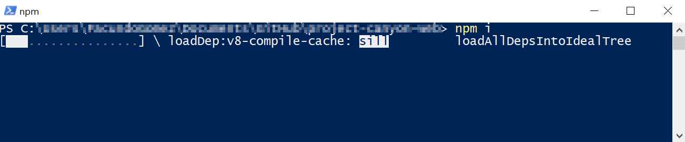
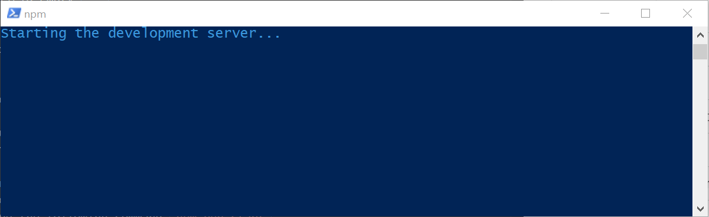
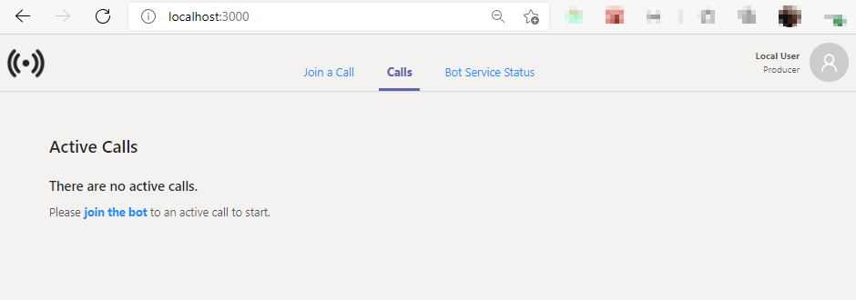
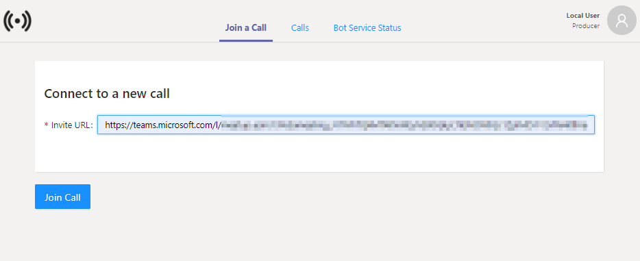
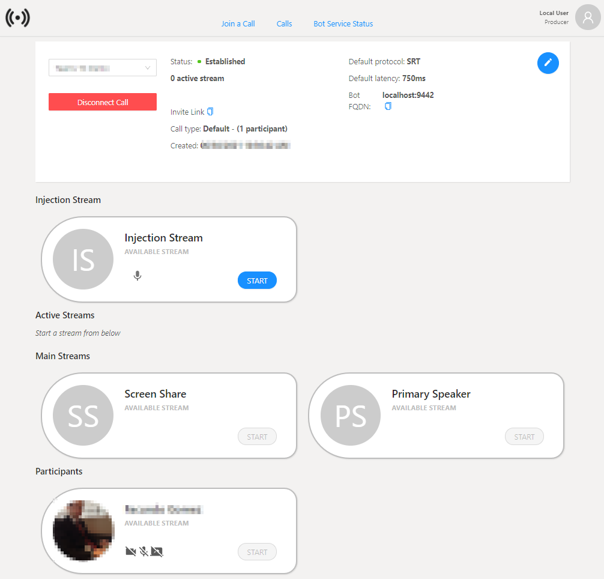

# How to run the solution locally

## Getting Started
The objective of this document is to explain the necessary steps to configure and run the Web Portal solution in a local environment. This includes:

  - [Install the Solution](#install-the-solution)
  - [Configure the Solution](#configure-the-solution)
  - [Run the Solution](#run-the-solution)
  - [Test the solution](#test-the-solution)

### Install the Solution

Go to the main directory of the solution open a terminal in that directory and enter the command `npm i`. It will start the installation of the packages used by the solution which may take a few seconds.

||
|:--:|
|*`npm i` command is running*|

Once finished you will notice that a directory called node_modules and a package-lock.json file have been created.

### Configure the Solution
To configure the solution open the `config.json` file located in the `public` folder of the solution's root directory and replace with the following configuration:

```json
{
  "buildNumber": "0.0.0",
  "apiBaseUrl": "https://localhost:8442/api",
  "msalConfig": {
    "spaClientId": "",
    "apiClientId": "",
    "groupId": "",
    "authority": "",
    "redirectUrl": ""
  },
  "featureFlags": {
    "DISABLE_AUTHENTICATION": {
      "description": "Disable authentication flow when true",
      "isActive": true
    }
  }
}

```

### Run the Solution
Once the solution is configured to run, go to the root directory of the solution, open a terminal and type the following command `npm run start`, a message like the following will appear and a new tab will open in the browser:

||
|:--:|
|*After entering the command `npm run start` the solution will start to run.*|

> Having the solution already configured, it will only be necessary to run the start command every time you want to use it.

Once the web portal finishes launching, the view of the opened tab in the browser will be refreshed showing the following:

||
|:--:|
|*Web portal after startup is complete*|

### Test the solution

[Create](https://support.microsoft.com/en-us/office/schedule-a-meeting-in-teams-943507a9-8583-4c58-b5d2-8ec8265e04e5) a new Microsoft Teams meeting and join it.

||
|:--:|
|*Steps to copy the invite Link from Microsoft Teams*|

Once you have joined the meeting copy the invitation link from the meeting, we will use it to join the bot to that meeting.

In the web portal solution click on the `Join a Call` tab in the top menu, copy the Microsoft Teams meeting invitation link to the `Invite URL` field and click on the `Join Call` button below.

||
|:--:|
|*Complete the "Invitation Url" field with the Microsoft Teams meeting invitation link.*|

After a few seconds the bot will join the Microsoft Teams meeting and the call details will be displayed on the web portal.

||
|:--:|
|*When the bot joins, the call details will be displayed.*|