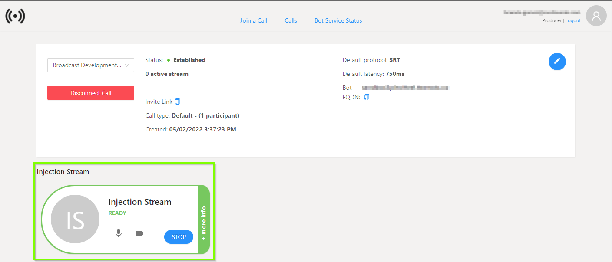

# How to use the Web UI solution

## Getting Started
This document explains how to operate the Broadcast Development Kit (BDK) through the Web UI sample. This includes:

- [Authentication](#authentication).
- [Check Bot Service Status](#check-bot-service-status).
- [Join the Bot into a meeting](#join-the-bot-into-a-meeting).
- [Call info status and streaming protocol configuration](#call-info-status-and-streaming-protocol-configuration).
- [How to inject media content into the meeting](#how-to-inject-media-content-into-the-meeting).
- [How to extract media content from the meeting](#how-to-extract-media-content-from-the-meeting).
- [Stream key for RTMP protocol](#stream-key-for-rtmp-protocol).

### Authentication
Once you entered the URL in the Browser for the first time, the Web UI renders the `Login` view. Please, click on the `Login with your account` button to enter your Azure AD credentials. 

Add or select the account you want to log in with.

### Check Bot Service Status
After authenticating, the first thing you need to check is the Bot Service status. You can verify it by entering in the `Bot Service Status` tab located in the header of the Web UI.

If the Bot Service Status is `Deprovisioned` like the picture above shows, you will need to provision the service by clicking on the `Start` button on the Bot Service Card. After a few minutes, the Bot Service will be provisioned.

### Join the Bot into a meeting
Once the Bot service is provisioned, you can invite the bot into a Microsoft Teams meeting. You need to go to the `Join a Call` tab located in the header of the Web UI.

Please enter the meeting URL in the `Invite URL` text field and click on the `Join Call` button below. After few seconds, the Bot will be joined into the meeting associated with the URL you provided.

> **NOTE:** To be able to invite the Bot into a meeting, a Microsoft Teams meeting needs to be scheduled.

### Call info status and streaming protocol configuration
Once the call is established, a Call details view will be rendered. In this view you will see the following sections:

- [Call Information View](#call-Information-view).
- [Injection Stream](#injection-stream).
- [Active Streams](#active-streams).
- [Main Streams](#main-streams).
- [Participants](#participants).

#### Call Information View
This section shows the information related to the call and the streaming protocol configured.

For the call you can see the following information:

- ***Status***: Displays the current call status (Establishing, Established, Terminated).
- ***Active Streams***: Displays the number of stream extractions active.
- ***Invite Link***: Displays a button to copy the Microsoft Teams meeting URL.
- ***Call type***: Displays type of call (Default, Live event) and the number of participants in the meeting.
- ***Created***: Displays the time when the Bot was joined into the meeting.

For the streaming protocol selected, you can see the following information.

- ***Default Protocol***: The streaming protocol selected for the call (SRT or RTMP).
- ***Bot FQDN***: The domain where the Bot Service is hosted.

>**NOTE**: If the selected protocol is SRT, you can also see other information related to that protocol, such as, `Latency`, `Passphrase`, among others. 

To change the streaming protocol, you need to click on the `Edit` button placed in this info section at the right top and select between `SRT` or `RTMP`. 

After clicking on the `Edit` button, you can select the desired protocol, by default the selected protocol is SRT. Also, for the SRT protocol, you can set default values for `Latency`, `Passphrase`, and `Key Length`. 

#### Injection Stream
This section renders a `Card` that allows you to configure and start the stream injection into the current meeting. To start an injection please refer to the section [How to inject a stream into the meeting](#how-to-inject-a-stream-into-the-meeting)

#### Active Streams
This section renders a `Card` for each [Main](#main-streams) and [Participant](#participants) stream/s being extracted. In those `Card` you can find the information related to the extracted stream itself and stop the extraction from here.

#### Main Streams
This section renders a `Card` for each `Main Stream` available for the current call from where you can start the stream extraction. The `Main Stream` are:

- Primary Speaker.
- Screen Share.
- Together Mode.
- Large Gallery. 

>**NOTE**: The `Together Mode` and the `Large Gallery` are only visible in this section if they were previously activated in the meeting.

#### Participants
This section renders a `Card` for each participant present in the meeting from where you can start the stream extraction.

>**NOTE**: To start an extraction, the participant must have their camera on, otherwise the `start` button will appear disabled on the participant `Card`. Also, to stream the screen share, one of the participants must be sharing the screen.

### How to inject media content into the meeting
To inject media content into a meeting, you need to go to the Injection Stream section and click on the start button. A side panel will appear on the right side, displaying the options to configure and start the injection.

You will need to configure these settings:

- Protocol: Select between the SRT and RTMP protocols.
- Mode: Select the mode in which you want to operate
    - For SRT: Listener or Caller.
    - For RTMP: Pull or Push.

Additionlly, based on the protocol and mode selected you will need to configure other properties, for example:

- SRT Protocol:
    - Injection URL (only for `Caller` mode).
    - Latency (optional).
    - Passphrase (optional).
    - Key Length (optional).
- RTMP Protocol: 
    - Injection URL (only for `Pull` mode).
    - Enable SSL (to stream over RTMP or RTMPS).

>**NOTE**: The injection URL for SRT in `Caller` mode or RTMP in `Pull` mode, is the URL where the Bot Service will establish the connection to pull the content.

>**NOTE**: For the SRT protocol, if you do not configure the `Latency`, `Passphrase`, `Key Length` properties, the default values configured for the call will be used.

Once you complete the configuration, click on the `Start` button at the bottom of the side panel.

If the Injection Stream could be successfully started, the Injection `Card` will change the status color to green, and you will be able to expand it to see the properties configured for the injection stream.

### How to extract media content from the meeting
To extract media content from the meeting you need can go to the Main Streams or Participants section and click on the `Start` button in the `Card` of the stream you want to extract.

Similar to the injection, a side panel will appear on the right side displaying the options to configure and start the extraction.

Based on the protocol selected in the `Call Info` section you will see different options on the side panel displayed.

For the SRT protocol, you can choose the `Default` or `Advanced` Settings configuration.

If you select the `Default Settings` the stream will start in `Listener` mode and using the global settings configured in the `Call Info` section.

If you select the `Advanced Settings` mode, you will be able to choose between `Listener` and `Caller` modes and also override the default values for `Latency`, `Passphrase`, and `Key Length`. 

Additionally, you will be able to select the `Audio Format` and enable/disable the `Video Overlay`.

>**NOTE**: The audio formats supported are AAC at 44100Hz or 48000Hz. 

Once you configure the values, click on the `Start` button placed at the bottom of the side panel.

For the RTMP protocol, the side panel shows the options available to configure, as shown in the following picture. 

After clicking on the `Start` button the extraction `Card` will change its status color to green if the stream could be started. Also, it will change the position from [Main Stream](#main-streams) or [Participants](#participants) section to [Active Streams](#active-streams) and you will be able to expand it to see the properties configured for the extraction stream.  

### Stream key for RTMP protocol
When the bot is joined into the meeting, a stream key is generated. This value is used for both, injection in push mode and extraction in pull mode. 

The stream key is displayed (obfuscated) in the side panel. It can be regenerated by clicking on the `Refresh Stream Key` button placed at the right where the value is rendered.

>**NOTE**: As was mentioned above, the stream key value is common for injection in push mode and all extractions that start in pull mode. Please stop all active streams in the corresponding modes before regenerating this value.
