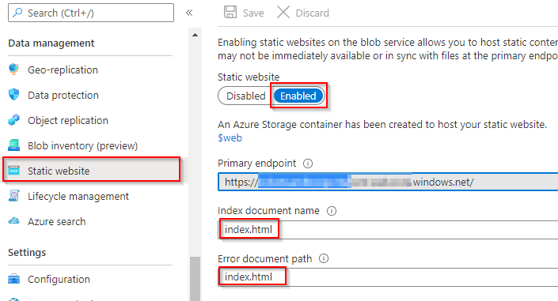
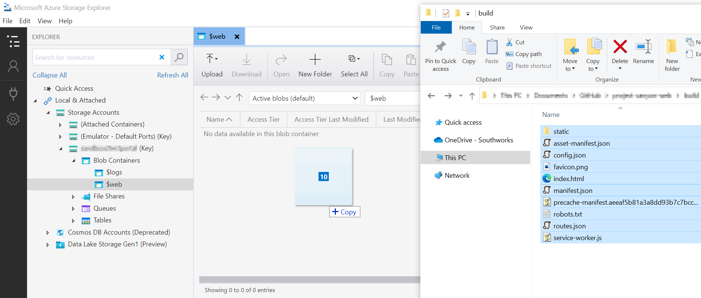

# How to run the solution in Azure

> todo
> change app registration of management api link

## About
This document describes the resources that must be created and configured to running the solution in Azure. This includes:

## Install Microsoft Azure Storage Explorer
Download and Install [Microsoft Azure Storage Explorer](https://azure.microsoft.com/en-us/features/storage-explorer/)

## Download and Install Node.js and npm
It is necessary to have [node.js and npm installed](../common/install_node_and_npm.md) in order to proceed with the following steps.

## Create a new App Registration

Create a new [App Registration](https://docs.microsoft.com/en-us/azure/active-directory/develop/quickstart-register-app) in Azure for the solution.

* `Name`: broadcaster-app-spa (or any other meaningful name). 

* `Authentication`: 

  * `Platform configurations`: Single-page application (the Redirect URLs will be configured during the project). 

  * `Implicit grant and hybrid flows`: Select both “Access tokens” and “ID tokens”. 

  * `Supported account types`: Accounts in this organizational directory only. 

* `Certificates and clients`: None. 

* `Token configuration`: Add a “groups claim” with following configuration app. Keep “Emit groups as role claims” unchecked for all types. 

  * `Id`: Group ID. 

  * `Access`: Group ID. 

  * `SAML`: Group ID. 

* `API permissions`: Add the following permissions to this application. Note that the first permission is the API scope that was created for the Management API application (dronetx-app-api). 


API / Permission name | Type | Admin consent
---------|----------|---------
 access_as_producer | Delegated | No
 User.Read  | Delegated | No


* `Expose an API`: None. 

* `App roles`: None. 

After creating this App Registration copy the app ID and modify the Manifest of the App Registration created to the [Management API](https://github.com/microsoft/Teams-Broadcast-Extension/blob/documentation/docs/how-to-run-the-solution-in-azure/app_registrations.md#how-to-setup-management-api-application-registration) adding the following property: 

 
```json
"knownClientApplications": ["{{application-id}}"] 
```

## Create an Azure Storage Account for the solution

[Create](https://docs.microsoft.com/en-us/azure/storage/common/storage-account-create?tabs=azure-portal) an Storage Account that will be used to host the single-page solution. 

- `Name`: broadcaster-portal (or any other meaningful name). 
- `Region`: same region as the rest of the resources. 
- `Performance`: Standard. 
- `Redundancy`: Locally-redundant storage (LRS). 

Leave the rest of the settings as-is. Once this Storage Account is created, go to the `Static website` option on menu in the `Data management` section of the storage account. In it, change the following settings and press `Save` button: 

- `Static website`: Enabled. 
- `Index document name`: index.html 
- `Error document path`: index.html 

||
|:--:|
|*Static Website Configuration*|

>Copy the value of `Primary endpoint` that will appear after pressing save, we will use it later to configure the solution.

## Build the solution

Go to the root directory of the solution, open a command prompt and enter the following command: `npm run build`.

>You can open a console in a particular directory by holding down the shift key and right clicking on an empty space and selecting the option "open powershell window here".
>


||
|:--:|
|*Console after enter the `npm run build` command*|

After a few seconds the build of the solution will be finished and a new build directory will be created in the root directory. The console will display a message like the following:

||
|:--:|
|*Console after enter the `npm run build` command*|

## Configuring the Solution

To configure the solution add a new [Redirect URI](https://docs.microsoft.com/en-us/azure/active-directory/develop/quickstart-register-app#add-a-redirect-uri) in the `Authentication` menu in the `Manage` section of the created App Registration with the value of the `Primary endpoint` in the `Static website` menu of the Storage Account (e.g: `https://broadcaster.z22.web.core.windows.net/`)

Open the `config.json` file located in the `build` folder of the solution's root directory (created in the [previous step](#build-the-solution)) and edit the following parameters:

```json
{
  "buildNumber": "0.0.0",
  "apiBaseUrl": "{{apiBaseUrl}}/api",
  "releaseDummyVariable": "empty",
  "msalConfig": {
    "spaClientId": "{{spaClientId}}",
    "apiClientId": "{{apiClientId}}",
    "groupId": "{{groupId}}",
    "authority": "https://login.microsoftonline.com/{{tenantId}}",
    "redirectUrl": "{{spaPrimaryEndpoint}}"
  },
  "featureFlags": {
    "DISABLE_AUTHENTICATION": {
      "description": "Disable authentication flow when true",
      "isActive": false
    }
  }
}

```


Placeholder | Description 
---------|----------
 apiBaseUrl | Url on which the management api of the backend solution is listening.
 spaClientId | Client Id of the App Registration of this frontend solution.
 apiClientId | Client Id of the App Registration of the ManagementApi. 
 groupId | ObjectId of the group created on Azure. 
 tenantId | Azure account Tenant Id.
 spaPrimaryEndpoint | `Primary endpoint` copied from `Static website` menu of Storage Account

## Uploading the build to the storage container

||
|:--:|
|*Copy the `Connection string` of th Storage Account*|


||
|:--:|
|*Open the `$web` container of the Storage Account*|

||
|:--:|
|*Copy the content of the `build` folder into the `$web` Container*|


## Testing the Solution

||
|:--:|
|*Web Portal login page*|