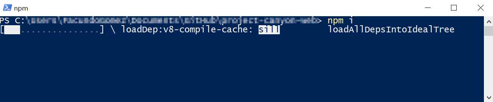
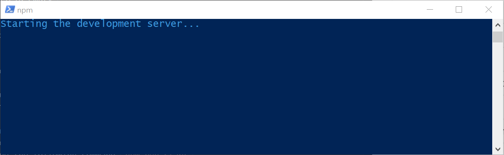
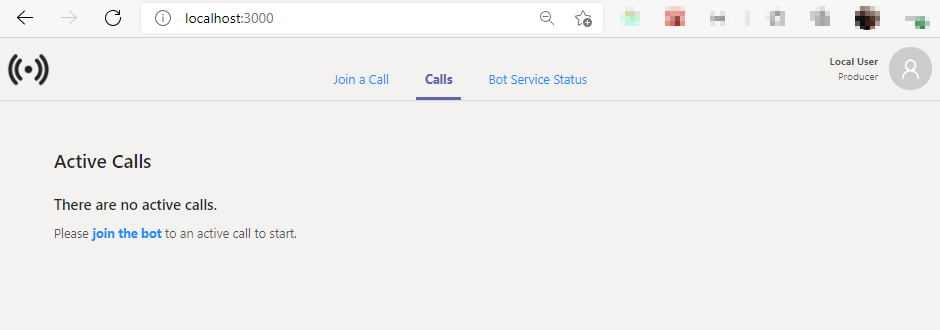
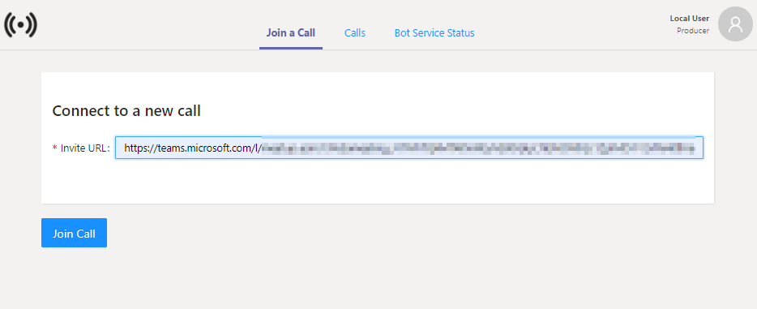

# [WIP] How to Run the Solution Locally

>**This is a draft and its format and content may change in future updates.**

- [[WIP] How to Run the Solution Locally](#wip-how-to-run-the-solution-locally)
  - [Run The Backend Solution](#run-the-backend-solution)
  - [Install Node.js and npm](#install-nodejs-and-npm)
  - [Install the Solution](#install-the-solution)
  - [Configuring the Solution](#configuring-the-solution)
  - [Running the Solution](#running-the-solution)
  - [Testing the solution](#testing-the-solution)

## Run The Backend Solution
It is necessary to have a [backend instance of the solution](https://github.com/microsoft/Teams-Broadcast-Extension) already configured and running locally or in Azure to which this application will connect to be functional.


## Install Node.js and npm
Install [node.js](https://nodejs.org/en/) and [npm](https://docs.npmjs.com/downloading-and-installing-node-js-and-npm), if you use the [node.js installer](https://nodejs.org/en/download/) it is already included with npm so you don't need to install it again.

To see if you already have Node.js and npm installed and to check the installed version, run in a console the commands `node -v` and `npm -v` and you will get a message (version number may change depending on the installed version) like the following: 

||
|:--:|
|*node.js and npm installed versions*|

> You can open a console by pressing `Win + R` keys, write `cmd` in the `Open` input and press `Ok`

## Install the Solution

Go to the main directory of the solution open a command console in that directory and enter the command `npm i`. It will start the installation of the packages used by the solution which may take a few seconds.

||
|:--:|
|*`npm i` command is running*|

Once finished you will notice that a directory called node_modules and a package-lock.json file have been created.

## Configuring the Solution
To configure the solution open the `config.json` file located in the `public` folder of the solution's root directory and edit the following parameters:

```json
{
  "buildNumber": "0.0.0",
  "apiBaseUrl": "https://{{apiBaseUrl}}/api",
  "releaseDummyVariable": "empty",
  "msalConfig": {
    "spaClientId": "{{spaClientId}}",
    "apiClientId": "{{apiClientId}}",
    "groupId": "{{groupId}}",
    "authority": "https://login.microsoftonline.com/{{tenantId}}",
    "redirectUrl": "http://localhost:{{port}}"
  },
  "featureFlags": {
    "DISABLE_AUTHENTICATION": {
      "description": "Disable authentication flow when true",
      "isActive": {{isActive}}
    }
  }
}

```


Placeholder | Description 
---------|----------
 apiBaseUrl | Url on which the management api of the backend solution is listening (e.g: `localhost:8442` if the backend is running locally and the ManagementApi is listening on port 8442)
 isActive | `false` if authentication flow is required, `true` if authentication flow is not required. If the backend is running locally, the value must be `true`.

 If the backend is running on Azure and you want to enable authentication, you need to create the respective [App Registrations]() and complete the following in the configuration file, otherwise, leave the field empty `""`


Placeholder | Description 
---------|----------
 spaClientId | CliendI of the App Registration of this frontend solution.
 apiClientId | CliendId of the App Registration of the ManagementApi. 
 groupId | ObjectId of the group created on Azure. 
 tenantId | Azure account Tenant Id.
 port | Port on which the frontend solution is running usually `3000`

## Running the Solution
Once the solution is configured to run, go to the root directory of the solution, open a command console and type the following command `npm run start`, a message like the following will appear and a new tab will open in the browser:

||
|:--:|
|*After entering the command `npm run start` the solution will start to run.*|

> Having the solution already configured, it will only be necessary to run the start command every time you want to use it.

Once the web portal finishes launching, the view of the opened tab in the browser will be refreshed showing the following:

||
|:--:|
|*Web Portal after startup is complete*|

## Testing the solution

[Create](https://support.microsoft.com/en-us/office/schedule-a-meeting-in-teams-943507a9-8583-4c58-b5d2-8ec8265e04e5) a new microsoft teams meeting and join it.

||
|:--:|
|*Steps to copy the invite Link from Microsoft Teams*|

Once you have joined the meeting copy the invitation link from the meeting and we will use it to join the bot to that meeting.

In the Web Portal solution click on the `Join a Call` tab in the top menu, copy the Microsoft Teams Meeting Invitation Link to the `Invite URL` field and click on the `Join Call` button below.

||
|:--:|
|*Complete the "Invitation Url" field with the Microsoft Teams meeting invitation link.*|